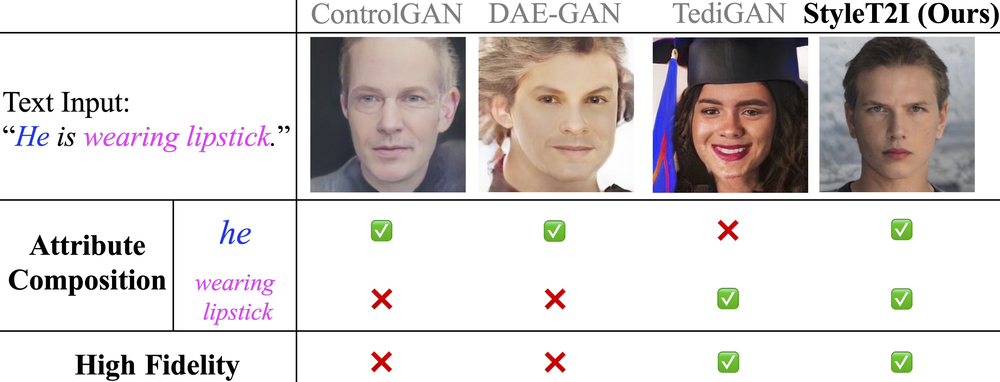

# StyleT2I: Toward Compositional and High-Fidelity Text-to-Image Synthesis [CVPR 2022]

**TL;DR**: We introduce a new framework, StyleT2I, to achieve compositional and high-fidelity text-to-image synthesis results.



**Figure 1.** When the text input contains underrepresented compositions of attributes, e.g., (<span style="color:blue">*he*</span>, <span style="color:magenta">*wearing lipstick*</span>), in the dataset, previous methods [1-3] incorrectly generate the attributes with poor image quality. In contrast, StyleT2I achieves better compositionality and high-fidelity text-to-image synthesis results.

## Paper

**StyleT2I: Toward Compositional and High-Fidelity Text-to-Image Synthesis**

[Zhiheng Li](https://zhiheng.li/), [Martin Renqiang Min](https://www.cs.toronto.edu/~cuty/), [Kai Li](http://kailigo.github.io/), [Chenliang Xu](https://www.cs.rochester.edu/~cxu22/)

NEC Laboratories America, University of Rochester

[preprint](https://arxiv.org/abs/2203.15799), [paper](https://openaccess.thecvf.com/content/CVPR2022/html/Li_StyleT2I_Toward_Compositional_and_High-Fidelity_Text-to-Image_Synthesis_CVPR_2022_paper.html), [video](https://youtu.be/-rTDfnKoVps)

**Contact**: Zhiheng Li (email: zhiheng.li@rochester.edu, homepage: https://zhiheng.li)

## Dependencies

pytorch
torchvision
torchtext
pandas
ninja

## Data Preparation

Put each dataset in a folder under the `data` directory as follows:

```bash
data
├── celebahq
├── cub
├── ffhq
└── nabirds
```

**CelebA-HQ**
download CelebAMask-HQ from [here](https://github.com/switchablenorms/CelebAMask-HQ) and unzip it to `data/celebahq/CelebAMask-HQ`

**CUB**
download CUB from [here](http://www.vision.caltech.edu/visipedia/CUB-200-2011.html) and unzip it to `data/cub/CUB_200_2011`

**NABirds**
download and unzip NABirds dataset from [here](https://www.dropbox.com/s/nf78cbxq6bxpcfc/nabirds.tar.gz?dl=1) to `data/nabirds`

## Pretrained StyleGAN2 Model

Download the pretrained StyleGAN2 models to `exp/pretrained_stylegan2` from [here](https://drive.google.com/drive/folders/1Clsg4Yp8wE9A07WWl3z5F3YJ0V8dyKc4?usp=sharing).

## Training

The following commands are the the bash scripts of training on CelebA-HQ dataset. For other datasets, simply replace the folder `/celebahq/` with other datasets, e.g., `/cub/`, `/ffhq/`, and `/nabirds/`.

### Pretrain StyleGAN2

Our StyleGAN2 code is based on [https://github.com/rosinality/stylegan2-pytorch](https://github.com/rosinality/stylegan2-pytorch)'s implementation.

If you prefer pretraining StyleGAN2 by youself, you can use the following command. Otherwise, use the pretrained model provided above.

```bash
bash scripts/celebahq/pretrain_stylegan2.sh
```

### Finetune CLIP

```bash
bash scripts/celebahq/ft_clip_text.sh
```

Note that finetuning CLIP is only available on CelebA-HQ and CUB datasets and not available on FFHQ and NABirds datasets because FFHQ and NABirds datasets do not have text annotations. However, StyleT2I can perform cross-dataset generation, i.e., StyleT2I-XD. More details are in the paper.

### Train StyleT2I

```bash
bash scripts/celebahq/train.sh
```

## Synthesize Images

```bash
bash scripts/celebahq/synthesize.sh
```

## References

[1] B. Li, X. Qi, T. Lukasiewicz, and P. Torr, “Controllable Text-to-Image Generation,” in NeurIPS, 2019.

[2] S. Ruan et al., “DAE-GAN: Dynamic Aspect-aware GAN for Text-to-Image Synthesis,” in ICCV, 2021.

[3] W. Xia, Y. Yang, J.-H. Xue, and B. Wu, “TediGAN: Text-Guided Diverse Face Image Generation and Manipulation,” in CVPR, 2021.

## Citation

```
@InProceedings{Li_2022_CVPR,
author = {Li, Zhiheng and Min, Martin Renqiang and Li, Kai and Xu, Chenliang},
title = {StyleT2I: Toward Compositional and High-Fidelity Text-to-Image Synthesis},
booktitle = {Proceedings of the IEEE/CVF Conference on Computer Vision and Pattern Recognition (CVPR)},
year = {2022}
}
```
